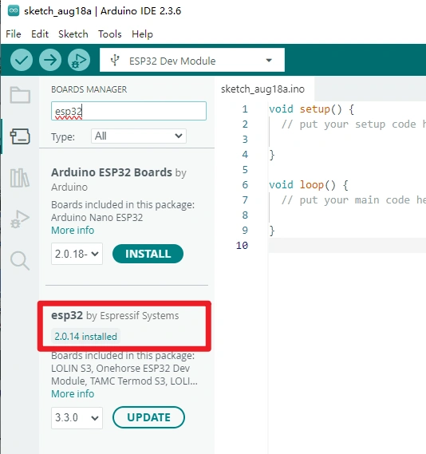
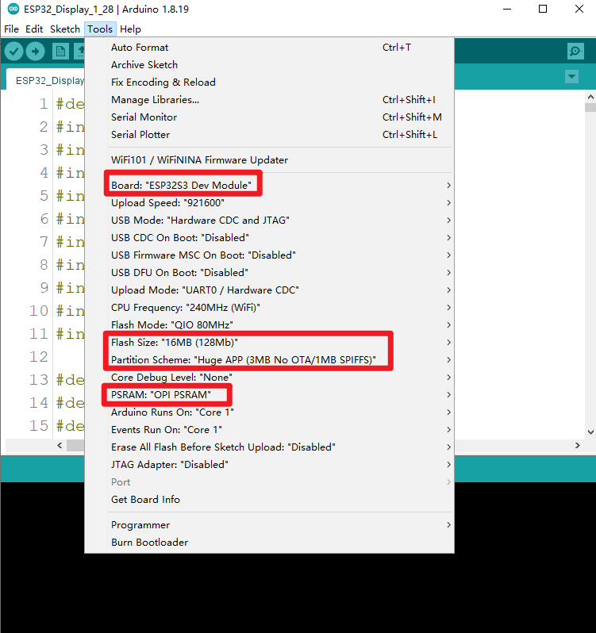

### 1, Product picture

### 2, Product version number

|      | Hardware | Software | Remark |
| ---- | -------- | -------- | ------ |
| 1    | V1.0     | V1.0     | latest |

### 3, product information

#### Display Module Specifications

| Main Chip: ESP32-S3R8      |                                                              |
| -------------------------- | ------------------------------------------------------------ |
| Processor                  | Equipped with high-performance Xtensa 32-bit LX7 dual-core processor, with a main frequency of up to 240MHz |
| System memory              | 512KB SRAM、8M PSRAM                                         |
| Storage                    | 16M Flash                                                    |
| **Screen**                 |                                                              |
| Size                       | 2.1 inch                                                     |
| Screen Type                | IPS                                                          |
| Touch Type                 | Capacitive Touch                                             |
| Resolution                 | 480*480                                                      |
| **Wireless Communication** |                                                              |
| Bluetooth                  | Bluetooth Low Energy and Bluetooth 5.0                       |
| WiFi                       | Support 802.11a/b/g/n，2.4GH                                 |
| **Hardware**               |                                                              |
| UART Interface             | 1x UART1, 1x UART0; ZX-MX 1.25-4P                            |
| I2C Interface              | ZX-MX 1.25-4P                                                |
| FPC connector              | 12P, Power supply burning port                               |
| Button                     | RESET button, BOOT button, confirmation button (knob press switch) |
| LED Light                  | Power indicator, LED ambient light                           |
| **Other**                  |                                                              |
| Power Input                | 5V/1A                                                        |
| Operating temperature      | -20~65℃                                                      |
| Storage temperature        | -40~80℃                                                      |
| Operation Power            | Module: DC5VMain Chip: 3.3V                                  |
| Size                       | 79*79*30mm                                                   |
| Shell                      | Aluminum alloy + plastic + acrylic                           |
| Net Weight                 | 80g                                                          |

### 4, Use the driver module

### 5,Quick Start

##### Arduino IDE starts

1.Download the library files used by this product to the 'libraries' folder.

C:\Users\Documents\Arduino\libraries\

2.Open the Arduino IDE

3.Open the code configuration environment and burn it.

### 6,Folder structure.

|--3D file： Contains 3D model files (.stp) for the hardware. These files can be used for visualization, enclosure design, or integration into CAD software.

|--Datasheet: Includes datasheets for components used in the project, providing detailed specifications, electrical characteristics, and pin configurations.

|--Eagle_SCH&PCB: Contains **Eagle CAD** schematic (`.sch`) and PCB layout (`.brd`) files. These are used for circuit design and PCB manufacturing.

|--example: Provides example code and projects to demonstrate how to use the hardware and libraries. These examples help users get started quickly.

|--factory_firmware: Stores pre-compiled factory firmware that can be directly flashed onto the device. This ensures the device runs the default functionality.

|--factory_sourcecode: Contains the source code for the factory firmware, allowing users to modify and rebuild the firmware as needed.

### 7,Pin definition

- I2C_SDA_PIN: 38

- I2C_SCL_PIN: 39

- ENCODER_A_PIN: 42

- ENCODER_B_PIN: 4

- SCREEN_BACKLIGHT_PIN: 6

PCF8574 Extended IO (via I2C address 0x21):

 \- P0:Touchscreen reset

\- P2: Touchscreen interrupt

\- P3: LCD power

\- P4: LCD reset

\- P5: Encoder button (INPUT_PULLUP)

LCD Bus-related（Arduino_ESP32RGBPanel）：

- 1, 2, 3, 5, 7, 8, 9, 10, 11, 12, 13, 14, 15, 16, 17, 18, 21, 40, 41, 45, 46, 47, 48